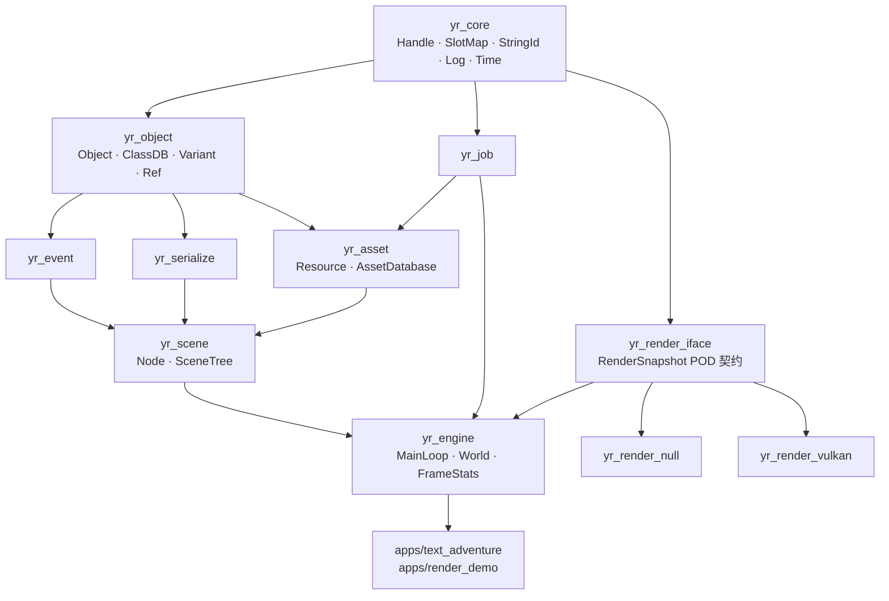

# YRuntime

> **一个以"理解游戏引擎运行时"为目的的 C++20 学习型项目。**
> 从零实现对象生命周期、反射、事件、场景树、序列化、异步资源、任务调度与主循环，
> 先跑通一个 headless 的文字冒险 Demo，再把自研 Vulkan 渲染器作为可替换 Backend 接入，
> 形成 `游戏状态 → Runtime → Renderer → GPU` 的完整链路。全程以 Godot 4.x 源码为参照系。


---

## 当前状态：M1 进行中

| M | 里程碑 | 状态 | 可运行物 |
|---|---|---|---|
| M0 | 工程地基（CMake/CI/Catch2/assert/log） | ✅ | `ctest` 全绿 + CI |
| M1 | 句柄、容器、时间 | 🔨 | Handle/SlotMap ✅；benchmark/StringId/Time 待做 |
| M1 当前门禁 | — | — | generation 回绕测试 + 100 万次 churn 未完成 |
| M2 | 反射与对象模型 | ⬜ | `yr_inspect` 反射查看器 |
| M3 | 事件系统与延迟调用 | ⬜ | 事件确定性重放测试 |
| M4 | 场景树与主循环 | ⬜ | headless 世界 tick 10000 帧 |
| M5 | 序列化与场景资源 | ⬜ | 手写 `.yrscn` + round-trip diff 为空 |
| M6 | 资源系统（异步加载） | ⬜ | 慢 IO 下不卡帧的加载曲线 |
| M7 | 任务系统（并行） | ⬜ | 加速比曲线 + TSan 干净 |
| **M8** | **文字冒险 Demo** | ⬜ | **可玩 ≥10 分钟 + 存读档（作品节点 1）** |
| M9 | 渲染契约与 NullBackend | ⬜ | 快照 dump/replay |
| **M10** | **Vulkan 后端接入** | ⬜ | **Runtime 驱动画面（作品节点 2）** |
| M11 | 工具链与打磨 | ⬜ | `.yrpak` 打包 + 覆盖率 |

## 目标架构



依赖**只允许向下**，由分层 CMake target 与 CI 脚本物理强制。
完整设计见 [`doc/01-architecture.md`](doc/01-architecture.md)。

## 文档

| | |
|---|---|
|  [START HERE](doc/START-HERE.md) | 当前状态 + 下一步 + 决策协议 + 分工 |
| [AI 交接文档](HANDOFF.md) | 面向后续 AI 的项目概况、约束、当前上下文与下一步 |
| [文档索引](doc/README.md) | 全部文档一览与维护规则 |
| [00 · 定位与成功判据](doc/00-vision.md) | 这是什么项目、做完算成功的标准、明确不做什么 |
| [01 · 目标架构](doc/01-architecture.md) | 分层、模块职责、核心概念、帧循环 14 阶段、线程模型 |
| [02 · 里程碑路线图](doc/02-roadmap.md) | M0~M11 任务清单 + 验收标准 + 常见坑 |
| [03 · 学习地图](doc/03-learning-map.md) | 知识点 → 里程碑映射、书单、16 个待做实验 |
| [04 · Godot 源码研究](doc/04-godot-study.md) | 按主题组织的源码索引与对照问题 |
| [05 · 工程规范](doc/05-engineering.md) | 构建/测试/日志/调试/剖析/Git/CI/代码风格 |
| [06 · 架构决策记录](doc/06-decisions.md) | 15 条 ADR：决策、备选、代价、推翻条件 |
| [07 · 作品展示策略](doc/07-portfolio.md) | 证据链、展示物、博客规划、40 道面试题 |

## 构建与运行

```bash
cmake --list-presets          # debug / release / asan
cmake --preset debug          # 配置（每个 preset 首次都要先 configure）
cmake --build --preset debug  # 构建
ctest --preset debug          # 测试
```

产物在 `build/<preset>/bin/`。给 IDE / clangd 用：`ln -sf build/debug/compile_commands.json .`

`yr::core` 已包含 `version`、`assert`、`log`、`Handle<T>`、`SlotMap<T>`。
`YR_LOG_*` 支持 tag + 运行期 level 过滤，DEBUG 级在 release 编译期剔除；`YR_ASSERT*` / `YR_VERIFY` 支持可注入 handler。

| 依赖 | 说明 |
|---|---|
| GCC 13+ 或 Clang 18+ | C++20 |
| CMake 3.25+ / Ninja | preset 格式 v6 需要 3.25 |
| Catch2 3 | `sudo apt install libcatch2-dev`（本机 3.7.1） |
| Linux | 见 ADR D12，不做跨平台移植 |
| Vulkan SDK ≥1.4 · GLFW3 | **仅 M10 的 `yr_render_vulkan` 需要**，`YR_BUILD_VULKAN_BACKEND=OFF` 时不需要 |

可选：`ccache`（装了自动启用）。

## 相关项目

- **[Yo_Renderer](https://github.com/yoyorm/Yo_Renderer)** — 大一暑假的 Vulkan PBR 渲染器（ECS + RHI + IBL + 阴影 + ImGui 编辑器，~8400 行）。
  本项目 M10 会把它的 `rhi/` 与 `render/` 层重构为可替换的 `RendererBackend`。
- **Godot Engine 4.x** — 本项目的学习参照系。

## 许可
[MIT](LICENSE)
