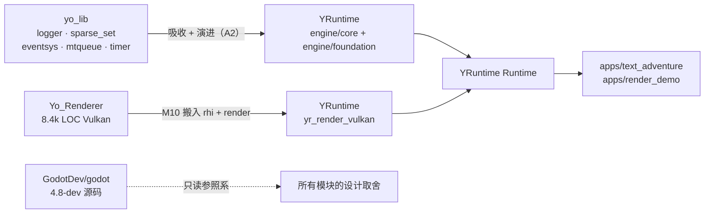

# 00 · 项目定位与成功判据

> 生成于 2026-09-19。本文回答三个问题：**这是什么项目**、**做完算成功的标准是什么**、**哪些事情明确不做**。
> 每当进度停滞或方向动摇时，回到本文而不是重新发明目标。

---

## 1. 定位

**YRuntime 是一个以"理解游戏引擎运行时"为唯一目的的学习型 C++ 工程，最终形态是一个可展示的个人作品。**

它不是：
- 不是"我的游戏引擎"——不追求功能数量，不追求可用性，不追求别人来用。
- 不是 Yo_Renderer 的续作——渲染是最后一阶段的**接入方**，不是主线。
- 不是 Godot 的复刻——Godot 是**参照系**，用来验证自己的设计判断，不是抄写对象。

它是一套**可运行的答案**，回答这些问题：

| 问题 | 由哪个模块回答 |
|---|---|
| 一个游戏对象从创建到销毁，中间经历了什么？谁保证不出悬垂指针？ | Handle / Object / SceneTree 延迟删除 |
| "场景"到底是内存里的什么东西？它怎么变成文件、文件怎么变回它？ | Node 树 + 序列化 + PackedScene |
| 资源什么时候加载、谁持有、什么时候卸载？加载卡帧怎么解决？ | AssetDatabase + 异步加载 + JobSystem |
| 一个游戏对象怎么通知另一个对象，而不用互相 include？ | EventBus + notification + deferred call |
| 主循环一帧里的十几件事，为什么是这个顺序？ | MainLoop 帧阶段 |
| 游戏逻辑和 GPU 之间的那条线，应该画在哪里？ | RenderSnapshot + RendererBackend |
| 为什么大引擎需要 SConstruct/CMake、导入管线、打包工具、测试？ | tools/ + CI + assets 管线 |

**每个模块都必须能回答"你为什么存在"。** 答不出来的模块就是该删的模块。

> **2026-09-22 修订**：M0 实践（4 天完成 Day 1~3c）快于 §9 的估算，但 M0 属于"配置类"工作（有明确答案、报错清晰）。
> **周期校准点定在 M2 完成时**——反射宏与序列化格式没有标准答案，那才是真实速度的试金石。届时用 M0+M1+M2 的实际数据重算 §9。

---

## 2. 三个前置假设（若与你实际情况不符，告诉我，我会调整全套计划）

规划时无法逐条与你确认，这里按最合理的默认值假设，并已作为 ADR 记录在 `06-decisions.md`（状态：暂定）：

| # | 假设 | 依据 | 若推翻的影响 |
|---|---|---|---|
| A1 | **投入节奏 ≈ 学期中 5~8h/周 + 假期集中冲刺**，总周期 6~9 个月 | 你有 CS-APP、yo_lib、GodotDev 等多个并行项目，且是在校状态 | 周期同比缩放；里程碑颗粒度需重新拆分 |
| A2 | **yo_lib 被"吸收"进 YRuntime 成为 `engine/core` 的一部分并继续演进**，而不是作为外部依赖 | Yo_Renderer 的经验教训是分层无法强制（V1/V2 反向依赖）；吸收后可自由重构 | 若坚持独立仓库，M0/M1 需改为 submodule + 接口冻结，改动成本上升 |
| A3 | **渲染解耦优先**：先定义 `RendererBackend` 抽象 + NullBackend，Vulkan 后端在 M10 才把 Yo_Renderer 的 `rhi/`+`render/` 搬入适配 | 你的目标是"研究 Runtime 与 Renderer 如何解耦"，而不是再写一个渲染器 | 若改成 submodule 直接复用，解耦练习会打折，但周期缩短约 4 周 |

---

## 3. 目标与非目标

### 3.1 目标（按优先级）

1. **P0 — 一个真实运行、可持续 tick 的 headless Runtime**：对象生命周期、场景树、主循环、时间、事件、资源、序列化、任务调度，全部自己实现并跑通。
2. **P0 — 一个用该 Runtime 做出的、可玩的非图形 Demo**（文字冒险），证明 Runtime 真的能承载游戏逻辑，而不是一堆单测通过的类。
3. **P1 — 工程化闭环**：CMake 分层、Catch2 测试、Sanitizer、CI、日志、性能统计、资源打包工具。
4. **P1 — Godot 源码对照能力**：对着架构图任意模块，能说清"Godot 怎么做 / 我怎么做 / 为什么不同"（口头即可，不产出笔记——D17）。
5. **P2 — Vulkan Backend 接入**：`RenderSnapshot → RendererBackend → GPU`，跑通一个由 Runtime 驱动的可视化 Demo。
6. **P2 — 作品可展示**：架构图、README、录屏、benchmark 数据、博客、可复述的设计决策。

### 3.2 非目标（明确不做，防止范围膨胀）

| 不做 | 理由 | 例外 |
|---|---|---|
| 完整编辑器 GUI | 无底洞，且与 Runtime 学习目标弱相关 | M11 可选做一个 ImGui 只读检视器 |
| 脚本语言绑定（GDScript/Lua） | 需要一整套 VM，会吃掉全部时间 | 列为 stretch（`02-roadmap.md` §S1） |
| 物理引擎 | 只需理解"物理作为 Server 如何被调度" | 实现一个 `IPhysicsBackend` 接口 + 玩具 AABB 实现即可 |
| 音频 | 同上 | 接口留空 |
| 跨平台（Windows/macOS） | Linux 已满足全部学习目标 | `platform/` 层保留薄抽象，不移植 |
| 网络 / 多人 | 与 Runtime 核心无关 | 无 |
| 新的图形学特性 | Yo_Renderer 已经覆盖，重复无收益 | 无 |
| 自研容器全家桶 | 时间花在刀刃上 | 只做 Handle/SparseSet/SmallVector 三个有学习价值的，其余用 STL |
| 追求 API 优雅 / 向后兼容 | 只有你一个人用 | 无 |

**范围控制规则**：任何新想法先进 `02-roadmap.md` §S（Stretch）清单，**不允许**直接插入当前里程碑。
每完成一个里程碑，才允许从 Stretch 里挑一条提升为正式任务。

---

## 4. 成功判据（可验证清单）

项目完成时，以下每条都必须能被第三方验证，而不只是"我觉得做到了"。

### 4.1 运行时能力
- [ ] `apps/text_adventure` 可执行文件启动后能连续游玩 ≥10 分钟内容，含至少 3 个场景切换。
- [ ] 游戏存档 → 退出 → 读档，状态完全一致（含跨场景资源引用）。
- [ ] headless 模式（无窗口、无渲染）下跑 10000 帧无泄漏、无崩溃，ASan+UBSan 干净。
- [ ] 帧循环各阶段耗时可打印，能指出"哪一阶段最贵"。

### 4.2 架构与代码质量
- [ ] 分层依赖单向，由 **CMake target + CI 脚本**强制（而不是靠自觉）：`grep` 不出任何反向 include。
- [ ] `engine/` 每一层都有独立的 Catch2 测试 target，`ctest` 全绿；关键语义（失效检测 / 生命周期顺序 / round-trip / 并发确定性）都有测试锁定。
- [ ] TSan preset 下 JobSystem 与异步资源加载无数据竞争报告。
- [ ] 没有任何裸 `new`/`delete`（CI grep 检查）；没有全局可变状态（`Engine` 单例除外，且有 ADR 说明）。

### 4.3 渲染接入
- [ ] `RendererBackend` 接口存在，`NullBackend` 与 `VulkanBackend` 都实现它，可在启动参数切换。
- [ ] `apps/render_demo` 中，修改 Runtime 里的游戏状态（移动一个 Node）→ 画面同步变化，Vulkan validation layer 零 error。
- [ ] Runtime 侧代码 **零** `#include <vulkan/...>`（CI grep 检查）——这是"解耦"的硬指标。

### 4.4 工具链
- [ ] `tools/yr_pack`：把 `assets/` 打成单个 `.yrpak`（manifest + blob），Runtime 能从 pak 加载。
- [ ] `tools/yr_scene_conv`：文本场景 ↔ 二进制场景互转，round-trip 一致。
- [ ] GitHub Actions：push 触发 build + ctest + format check + 架构门禁，README 有徽章。（clang-tidy 可选，见 `05-engineering.md` §1）

### 4.5 理解与表达（最重要，也最容易被跳过）
- [ ] 能对着架构图脱稿讲 20 分钟：每层为什么存在、数据怎么流、哪里是单线程边界。
- [ ] 对着 `01-architecture.md` 的任意一个模块，能说出 Godot 里对应的是哪个文件、关键差异是什么。
- [ ] 能回答 `07-portfolio.md` §5 的面试题，且答案里包含**自己的取舍**而非背书。
- [ ] 能说出**至少一个**自己后来推翻的设计，以及当时为什么会那么想（有被推翻的 ADR 最好，口头讲清也算——不设数量指标）。
- [ ] **`git log` 读下来能看出设计怎么演进的**：commit message 正文里能找到"为什么这么改"。
      这是取消仓库内笔记之后（ADR D17）唯一的高频记录载体——写它是为了**三个月后的自己**能看懂，不是为了给别人看。

---

## 5. 能力矩阵（这个项目向别人展示什么）

| 模块 | 展示的 C++ 能力 | 展示的引擎工程能力 |
|---|---|---|
| Handle / SlotMap | 模板、位运算、`[[nodiscard]]`、值语义 | 悬垂引用检测、ABA 问题 |
| Ref / RefCounted | RAII、移动语义、 intrusive 计数、循环引用 | 资源生命周期策略 |
| ClassDB / 反射 | 宏工程、类型擦除、成员指针、`if constexpr`、concepts | 属性系统、编辑器/序列化/脚本的共同地基 |
| Variant | union + tag、拷贝语义、性能取舍 | 动态类型在引擎里的位置 |
| EventBus / MessageQueue | 变参模板、`std::function` 成本、重入安全 | 解耦通信、延迟调用、帧内顺序确定性 |
| Node / SceneTree | 组合模式、虚析构、迭代中删除 | 生命周期通知、延迟删除、树遍历策略 |
| 序列化 | 字节序、对齐、版本兼容、visitor | 场景格式设计、资源引用解析 |
| AssetDatabase | 异步模型、future、引用计数、LRU | 导入管线、加载不卡帧、卸载策略 |
| JobSystem | 内存模型、atomic、false sharing、work stealing | 任务粒度、主线程 join 点、确定性 |
| MainLoop | 固定步长积分、时间缩放 | 帧阶段顺序、为什么是这个顺序 |
| RenderSnapshot / Backend | POD 契约、双缓冲、frame-in-flight | 逻辑线程 / 渲染线程边界 |
| tools + CI | CMake 现代用法、Python/脚本 | 构建系统、资源打包、自动化质量门禁 |

这张表同时是 `07-portfolio.md` 里简历与面试话术的素材来源。

---

## 6. 为什么 headless-first 是正确的顺序

这是本项目最重要的方法论判断，值得写清楚（面试也会问）：

1. **反馈回路更短**：没有 GPU/窗口/驱动，一个 `ctest` 几秒出结果，能一天迭代几十次。图形项目一次崩溃要排查半天是不是同步问题。
2. **强迫解耦**：如果一开始就有渲染，所有设计都会不自觉地向"方便画出来"倾斜。先做 headless，
   `RendererBackend` 的接口才会被迫长成"消费纯数据快照"的样子——这正是 Godot `RenderingServer`、
   Unreal render thread 的做法。
3. **CI 可跑**：GitHub Actions 免费 runner 没有 GPU。headless + NullBackend 让全部核心逻辑都能在 CI 里验证。
4. **暴露真问题**：对象生命周期、序列化、线程安全这些问题在图形项目里会被"画面看起来对"掩盖，
   在 headless 里无处可藏。

代价：前 4 个月没有画面，容易失去动力。**对策**：M4 结束就要有一个"能跑起来的 tick 世界"，
M8 结束有可玩 Demo——即每 4~6 周必须有一个可运行、可录屏的东西。见 `02-roadmap.md` 的"可运行物"列。

---

## 7. 与既有项目的关系

- **yo_lib**：`logger` / `yo_assert` / `yo_sparse_set` / `yo_eventsys` / `yo_mtqueue` / `yo_timer` 是 M0~M7 的起点。
  搬进来时**必须逐个重构**（补测试、统一命名、去掉 `std::function` 的过度使用），不是简单 copy。
  `yo_matrix.h`（`std::vector` 存储的矩阵）不要搬——数学库直接用 GLM，别在这浪费时间。
- **Yo_Renderer**：M10 才动它。它的 `core/`（Ref/Handle/SparseSet/ObjectDB）会与 YRuntime 的 `engine/core`
  产生概念重叠，届时以 YRuntime 版本为准。它的 `doc/modularization-plan.md` 里的 V1/V2 反向依赖问题，
  正好作为"为什么 YRuntime 要用分层 CMake target"的反面教材。
- **GodotDev/godot**：只读。见 `04-godot-study.md`。

---

## 8. 风险与应对

| 风险 | 概率 | 影响 | 应对 |
|---|---|---|---|
| 前 4 个月没画面，动力衰减 | 高 | 项目废弃 | 每里程碑必须有可运行物 + 录屏；roadmap 的 checkbox 与根 README 里程碑表提供进度可见性 |
| 反射/序列化泥潭（宏调不通、格式改了又改） | 高 | M2/M5 超期 2 倍 | 先做最小可用版本（只有 int/float/string/vec3 三种属性），跑通再扩展；宏控制在 3 个以内 |
| JobSystem 引入难复现的 bug | 中 | 后期全线不稳定 | 严格后置到 M7；之前所有模块必须先在单线程跑通并测试；TSan preset 常开 |
| 与 yo_lib/Yo_Renderer 代码纠缠 | 中 | 依赖混乱 | A2/A3 + 分层 CMake target + CI 反向依赖检查 |
| 学期课业挤压 | 高 | 周期拉长 | 里程碑颗粒度 ≤2 周，每步独立可提交；允许"维持周"（只读 Godot + 在对话里讨论设计，不写代码），但不允许连续两周 |
| 过度依赖 AI 生成代码，导致无法解释 | 高 | 作品失去意义 | `05-engineering.md` §9 的"自己写"工作法 + 每模块完成后脱稿讲解 + commit message 写"为什么"（ADR D17） |
| 范围膨胀（想加编辑器/脚本/物理） | 高 | 永远做不完 | §3.2 非目标 + Stretch 清单制度 |

---

## 9. 时间预算（基于 A1）

| 阶段 | 里程碑 | 周数 | 累计 | 可运行物 |
|---|---|---|---|---|
| 地基 | M0~M1 | 3~4 | 1 个月 | `ctest` 全绿的核心库 |
| 对象模型 | M2~M3 | 4~5 | 2 个月 | `yr_inspect` 反射查看器 |
| 运行时成形 | M4~M6 | 8~11 | 4.5 个月 | headless 世界 tick + 场景存读档 |
| 并行与 Demo | M7~M8 | 5~7 | 6 个月 | **可玩的文字冒险** ← 第一个作品节点 |
| 渲染接入 | M9~M10 | 6~8 | 8 个月 | **画面由 Runtime 驱动** ← 第二个作品节点 |
| 打磨 | M11 | 2~4 | 9 个月 | 完整仓库 + 博客 + README |

假期（寒假/暑假）按 3 倍速折算。**如果某个里程碑超期 50%，不要压缩验收标准，而是砍它的功能范围**（见 `02-roadmap.md` 每个 M 的"降级方案"）。
