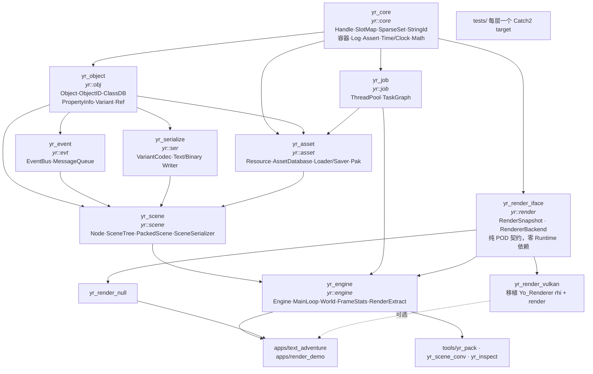
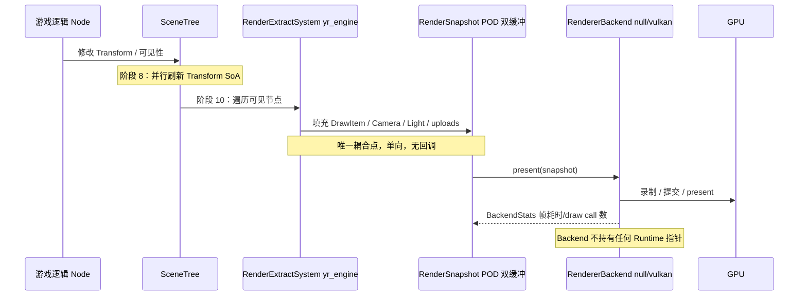

# 01 · 目标架构

> 生成于 2026-09-19。**开工前必读，每个里程碑开工前重读一遍。**
> 本文描述的是**目标形态**（约 M10 时的样子）。架构不是一次成型的，§10 给出每个阶段的实际形状。
>
> ⚠️ 本文里的 C++ 片段全部是**接口契约草案（只有签名，没有实现）**，用来固定模块边界与命名，
> 不是让你照抄的代码。实现必须自己写——见 `05-engineering.md` §9。

---

## 1. 五条设计原则

后面所有取舍都由这五条推导出来。想加东西时先对照这五条。

| # | 原则 | 具体含义 | 反面教材 |
|---|---|---|---|
| **P1** | **依赖单向，且由构建系统强制** | 每个分层 = 一个 CMake target；下层 target 在物理上无法 include 上层头文件 | Yo_Renderer V1/V2：`core/TextureCache.h` include `render/resource/cpu/Texture.h` |
| **P2** | **所有权显式** | 任何数据都能回答"谁创建、谁能改、谁销毁、活多久"；禁止裸 `new/delete`、禁止用裸指针表达所有权 | Yo_Renderer V7：`float* sunOrbitRadius_` 指回 Application 成员 |
| **P3** | **单一数据源** | 一份信息只在一处定义。跨模块传递用结构体，不用 `void*`；GPU 布局、常量、字符串只有一份 | Yo_Renderer V5/V6：光照布局三份手写副本、`const void* lightsData` |
| **P4** | **线程边界画在数据上，而不是画在函数上** | 明确列出"哪些数据只能主线程碰"；跨边界只传 **POD 快照**或**任务**，不传对象指针 | — |
| **P5** | **可测试优先于优雅** | 每个模块必须能在**无 GPU、无窗口、无文件系统**（可注入内存 FS）的环境下被单测 | Yo_Renderer 的测试被迫 include Vulkan 头 |

补充一条工作方法：**先写头文件 + 测试，再写实现。** 头文件是设计，测试是规格，实现是细节。

---

## 2. 分层与构建目标



| target | namespace | 依赖 | 一句话职责 | 里程碑 |
|---|---|---|---|---|
| `yr_core` | `yr::core` | 仅 std | 句柄、容器、字符串驻留、日志、断言、时间 | M0~M1 |
| `yr_job` | `yr::job` | core | 线程池 + 任务依赖图 | M7 |
| `yr_object` | `yr::obj` | core | 对象模型 + 反射 + 动态值 | M1~M2 |
| `yr_event` | `yr::evt` | object | 类型化事件总线 + 延迟调用队列 | M3 |
| `yr_serialize` | `yr::ser` | object | 值/属性的编解码与格式后端 | M5 |
| `yr_asset` | `yr::asset` | object, job | 资源注册、加载、卸载、pak | M6 |
| `yr_scene` | `yr::scene` | object, event, serialize, asset | 节点树 + 场景树 + 场景存读档 | M4~M5 |
| `yr_engine` | `yr::engine` | 以上全部 + render_iface | 主循环、世界、帧统计、快照抽取 | M4, M9 |
| `yr_render_iface` | `yr::render` | core | 渲染契约（**这是解耦的关键层**） | M9 |
| `yr_render_null` | `yr::render` | iface | 空后端，CI/测试用 | M9 |
| `yr_render_vulkan` | `yr::render::vk` | iface (+Vulkan SDK) | Vulkan 后端 | M10 |

> **关键设计**：`yr_render_iface` 只依赖 `yr_core`，**不依赖 `yr_scene`/`yr_engine`**。
> 于是"Runtime 侧零 `#include <vulkan/...>`"和"Backend 侧零 `#include <yr/scene/...>`"
> 同时成为构建系统层面**物理上不可能违反**的事实。这是 §7 解耦方案的地基。

---

## 3. 目录布局

```
YRuntime/
├── CMakeLists.txt              # 顶层：project / options / add_subdirectory
├── CMakePresets.json           # debug / release / asan / tsan / ci
├── cmake/
│   ├── YrLibrary.cmake         # yr_add_library(NAME ns DEPS ...) 封装警告/标准/安装
│   ├── YrWarnings.cmake
│   ├── YrSanitizers.cmake
│   └── YrCheckDeps.cmake       # CI 用的反向依赖 / 禁用符号检查脚本入口
├── engine/
│   ├── core/       ├── include/yr/core/*.h  ├── src/*.cpp  └── CMakeLists.txt
│   ├── job/        ├── include/yr/job/...
│   ├── object/     ├── include/yr/object/...
│   ├── event/      ├── include/yr/event/...
│   ├── serialize/  ├── include/yr/serialize/...
│   ├── asset/      ├── include/yr/asset/...
│   ├── scene/      ├── include/yr/scene/...
│   ├── engine/     ├── include/yr/engine/...
│   └── render/
│       ├── iface/  ├── include/yr/render/...
│       ├── null/
│       └── vulkan/
├── apps/
│   ├── text_adventure/         # M8：可玩的非图形 Demo（作品节点 1）
│   └── render_demo/            # M10：Runtime 驱动的画面（作品节点 2）
├── tools/
│   ├── yr_pack/                # assets/ → .yrpak
│   ├── yr_scene_conv/          # 文本场景 ↔ 二进制场景
│   └── yr_inspect/             # 反射查看器（M2 产出）
├── tests/
│   ├── core/  object/  event/  serialize/  asset/  scene/  engine/  render/
│   └── CMakeLists.txt          # 每层一个 Catch2 target，全部注册到 ctest
├── third_party/                # nlohmann_json（M5 前期用）、GLM、Catch2（若不用系统包）
├── assets/                     # 源资源（示例剧情、模型、贴图）
├── doc/                        # 本目录
├── .clang-format  .clang-tidy  .gitignore  .editorconfig
└── .github/workflows/ci.yml
```

**约定**
- 头文件在 `include/yr/<layer>/`，实现在 `src/`，外部一律 `#include <yr/core/handle.h>`（尖括号 + 完整路径）。
  好处：include 语句本身就暴露了分层，反向依赖一眼可见。
- 文件名 `snake_case.h/.cpp`（统一，不要像 Yo_Renderer 那样 PascalCase 与 snake_case 混用）。
- 类名 `PascalCase`，函数/变量 `camelCase`，成员变量 `trailing_`（yo_lib 已有此风格，保持一致）。
- 常量 `kCamelCase`，模板参数 `T`/`U`，命名空间全小写。

---

## 4. 核心概念

每个概念按同一模板描述：**为什么存在 → 接口契约 → 所有权 → 失败模式 → Godot 对照 → 学习点**。
"Godot 对照"的路径均已在本机 `/home/yoyorm/Code/GodotDev/godot` 验证存在，详见 `04-godot-study.md`。

### 4.1 `Handle<T>` / `SlotMap` —— 一切引用的地基

**为什么存在**：游戏里到处是"引用一个可能已经被销毁的对象"。裸指针无法检测悬垂，`shared_ptr` 无法紧凑存储且掩盖生命周期错误。
句柄 = `index + generation`，销毁时 generation 自增，旧句柄自动失效。这是所有引擎的 ABA 基础课。

```cpp
namespace yr::core {
struct HandleBits { static constexpr uint32_t kIndex = 24, kGeneration = 40; };  // 64-bit，也可 32/32

template <typename T> class Handle {              // 值语义、可拷贝、可比较、可哈希
 public:
  Handle() noexcept;                              // == kInvalid
  [[nodiscard]] bool valid() const noexcept;
  [[nodiscard]] uint32_t index() const noexcept;
  [[nodiscard]] uint64_t raw() const noexcept;
  static constexpr Handle<T> invalid() noexcept;
};

template <typename T> class SlotMap {             // 稠密数组 + 空闲链，O(1) 增删查
 public:
  [[nodiscard]] Handle<T> insert(T value);
  bool erase(Handle<T> h);                        // 返回 false = 句柄已失效
  [[nodiscard]] T* get(Handle<T> h);              // 失效返回 nullptr（不 assert，交给调用方决策）
  [[nodiscard]] const T* get(Handle<T> h) const;
  [[nodiscard]] T& operator[](Handle<T> h);       // 失效 = UB，Debug 下 assert
  [[nodiscard]] size_t size() const noexcept;
  // 迭代：稠密数组顺序，稳定且 cache 友好；不提供"迭代中安全删除"（那是 SceneTree 的责任）
};
}
```

**所有权**：`SlotMap` 独占其元素。`Handle` 不延长生命周期（弱引用语义）。需要延长生命周期时用 `Ref<T>`（§4.4）。
**失败模式**：① 用失效句柄访问 → `get()` 返回 nullptr / `operator[]` Debug assert；② index 复用导致 ABA → generation 位数足够 + 单测覆盖回绕；③ `Handle<void>` 与 `Handle<T>` 混用 → 模板参数强制类型，转换需显式 `Handle<T>::from_void()`。
**Godot 对照**：`core/templates/rid.h`（`RID`）、`core/templates/rid_owner.h`（`RID_Owner`，就是 slot map + generation）、`core/object/object_id.h`。
**学习点**：位域打包、稠密/稀疏数组、cache 局部性（写 benchmark 对比 `std::unordered_map`，见 `03-learning-map.md` §4）。

> **决策点**：`ObjectID`（全局唯一，跨表查 ObjectDB）与 `Handle<T>`（表内索引）**是两个东西**，都要有。
> Godot 也是这样：`ObjectID` 走全局 `ObjectDB`，`RID` 走各 Server 的 `RID_Owner`。别想着统一成一个。

### 4.2 `Object` / `ObjectID` / `ClassDB` —— 反射地基

**为什么存在**：序列化、属性检视、事件、（未来的）脚本绑定，全都需要"运行时知道一个对象有哪些属性、能按名字读写它们、能按类名创建实例"。
没有反射，这四件事每件都要手写一遍 switch。

```cpp
namespace yr::obj {
class ObjectID { /* uint64：index(24) + generation(40)，全局唯一，可跨模块传递 */ };

class Object {                                    // 非侵入式基类，所有可反射对象继承它
 public:
  virtual ~Object();
  [[nodiscard]] ObjectID id() const noexcept;
  [[nodiscard]] virtual const ClassInfo* klass() const noexcept = 0;  // 由 YR_CLASS 宏生成
  void notification(uint32_t what);               // 生命周期/自定义通知，见 §4.6
  [[nodiscard]] Variant get(StringId name) const;
  bool set(StringId name, const Variant& v);
};

struct PropertyInfo {
  StringId name; Variant::Type type; uint32_t flags;   // kEditable/kSerialized/kReadOnly...
  StringId class_hint;                                  // 对象类型属性用
};

class ClassInfo {
 public:
  [[nodiscard]] StringId name() const;
  [[nodiscard]] const ClassInfo* parent() const;
  [[nodiscard]] std::span<const PropertyInfo> properties() const;
  [[nodiscard]] Object* (*factory)();                   // 按类名创建
  bool get_property(const Object*, StringId, Variant&) const;
  bool set_property(Object*, StringId, const Variant&) const;
  bool is_base_of(StringId other) const;                // 继承链查询
};

class ClassDB {                                       // 进程级注册表（唯一允许的全局单例之一）
 public:
  static void register_class(const ClassInfo&);
  static const ClassInfo* get_class(StringId);
  static Object* instantiate(StringId class_name);    // 失败返回 nullptr + 日志
  static std::vector<StringId> all_classes();
  static std::vector<StringId> inheritors_of(StringId);
};
}

// 注册宏（**只允许这三个宏**，宏工程是本项目最大的调试黑洞，必须克制）
#define YR_CLASS(Type, Parent)          /* 生成 klass()、静态 ClassInfo、自动注册器 */
#define YR_PROPERTY(Type, name, member) /* 追加 PropertyInfo + get/set 成员指针适配 */
#define YR_BIND_METHOD(...)             /* 可选，M11 stretch：方法绑定 */
```

**属性存取用"成员指针 + 类型擦除"**：`PropertyInfo` 里存 `Variant (Object::*)()` 之类的适配 lambda，
避免虚函数爆炸。这是本项目最值得琢磨的一段模板/宏工程。

**所有权**：`ClassDB` 只持有 `ClassInfo`（静态数据），不持有实例。实例所有权见 §4.4/§4.6。
**失败模式**：① 忘记注册类 → 反序列化时报"unknown class"，**必须给出清晰错误 + 已注册类列表**；② 静态注册顺序（SIOF）→ 用"函数内 static + 显式 `register_core_classes()` 调用"而不是依赖全局构造顺序（Godot 就是显式调用 `register_core_types()`）；③ 宏展开报错难读 → 用 `clang -E` 展开排查，并把宏限制在 3 个。
**Godot 对照**：`core/object/object.h`、`core/object/class_db.h`（+`.cpp` 里的 `ClassDB::bind_*`）、`core/object/property_info.h`、`core/object/method_bind.h`、`core/register_core_types.cpp`。
**学习点**：宏工程（`__VA_ARGS__`、token pasting、X-macro）、成员指针、类型擦除、`if constexpr`、concepts、SIOF。

### 4.3 `Variant` —— 动态值

**为什么存在**：属性系统需要一个"能装任何类型"的值容器（`ClassDB::get_property` 的返回类型）；
事件负载、序列化中间表示、（未来）脚本互操作，都需要它。Godot 的整个引擎 API 都建立在 Variant 上。

```cpp
namespace yr::obj {
class Variant {                                   // tag + union，POD 可拷贝可比较
 public:
  enum class Type : uint8_t { kNull, kBool, kInt, kFloat, kString, kStringId,
                              kVec2, kVec3, kVec4, kColor, kArray, kDict, kObjectID };
  Variant(); /* + 每种类型一个非 explicit 构造 + 转换访问器 */
  [[nodiscard]] Type type() const noexcept;
  [[nodiscard]] bool is_nil() const noexcept;
  template <typename T> [[nodiscard]] T as() const;            // 类型不符 → Debug assert + 返回默认值
  template <typename T> [[nodiscard]] std::optional<T> try_as() const;
  bool operator==(const Variant&) const;
};
using Array = std::vector<Variant>;               // 先不写 COW，M5 之后再考虑
using Dict  = std::vector<std::pair<StringId, Variant>>;  // 保序！序列化需要确定性
}
```

> **第一版只做 `kNull/kBool/kInt/kFloat/kString/kVec3/kObjectID/kArray/kDict` 九种**，其余等真的需要再加。
> `Dict` 用**保序 vector** 而不是 `unordered_map`：序列化输出必须逐字节可复现，否则 diff/测试全是噪音。

**失败模式**：① 类型混淆 → `try_as` + Debug assert；② 拷贝开销 → 小对象直接拷贝，`Array/Dict` 走 heap，先不优化；③ 无限递归（Dict 套 Dict）→ 序列化时限制深度。
**Godot 对照**：`core/variant/variant.h`（3000+ 行，**只看结构和 Type 枚举，不要试图读完**）、`core/variant/variant_parser.h`。
**学习点**：tagged union 的正确写法、`std::variant` 为什么不适合（体积/性能/无法扩展）、COW 字符串。

### 4.4 `RefCounted` / `Ref<T>` —— 共享所有权

**为什么存在**：资源（贴图、网格、剧情数据）天然是"多方共享、最后一个用完就释放"。手写引用计数会漏，`shared_ptr` 的控制块分离 + 无法侵入对象内部。

```cpp
namespace yr::obj {
class RefCounted : public Object {                // 侵入式计数
 public:
  void ref() const noexcept;
  bool unref() const noexcept;                    // 返回 true = 计数归零，调用方负责 delete
  [[nodiscard]] uint32_t refcount() const noexcept;
};
template <typename T> class Ref { /* 拷贝/移动/比较/-> /*/ get() / is_valid() */ };
template <typename T, typename... A> Ref<T> make_ref(A&&...);
}
```

**必须显式处理的三件事**（这也是面试高频题）：
1. **循环引用**：父子互指 → 用 `WeakRef<T>`（持 `ObjectID`，用时查 ObjectDB）。`SceneTree` 的 parent 指针**不是** Ref，是裸指针 + 明确所有权规则。
2. **跨线程计数**：计数用 `std::atomic<uint32_t>`，`memory_order_acq_rel`。M7 之前单线程可用 relaxed，但要留注释。
3. **析构时机不可预测**：资源的 GPU 句柄不能在任意线程的析构里释放 → 归零时投递到"延迟销毁队列"，主循环帧末统一处理（Yo_Renderer 的 `VulkanResourceTable` 已经踩过这个坑）。

**Godot 对照**：`core/object/ref_counted.h`（`class Ref` 在 **第 59 行**，`RefCounted`/`WeakRef` 同文件）。
**学习点**：intrusive vs non-intrusive、内存序、`enable_shared_from_this` 的等价物。

### 4.5 `EventBus` / `MessageQueue` —— 解耦通信

**为什么存在**：让"玩家拾取道具"这件事，被成就系统、UI、音效、任务系统同时听到，而它们互相不知道对方存在。
以及：让"在当前帧的安全时刻执行某个操作"成为可能（deferred call）——这是解决"遍历中修改容器"的标准手段。

```cpp
namespace yr::evt {
struct IEvent { static constexpr StringId kTypeId{}; };   // 每个事件类型继承并定义 kTypeId

class EventBus {
 public:
  template <typename E> Subscription subscribe(std::function<void(const E&)>);
  void unsubscribe(Subscription);
  template <typename E> void publish(const E&);          // **立即**派发（同线程、可重入）
  template <typename E> void post(const E&);             // **入队**，下一次 flush 时派发
  void flush();                                          // 由 MainLoop 在固定阶段调用
  [[nodiscard]] size_t pending() const noexcept;
};

class MessageQueue {                                     // 延迟调用：任意 (ObjectID, StringId method, args)
 public:
  void push_deferred(ObjectID target, StringId method, std::vector<Variant> args);
  void flush();                                           // 帧内固定点；flush 中新增的消息进下一帧
};
}
```

**三条必须写进测试的语义**（这是本模块真正的难点，不是模板）：
| 语义 | 决策 | 理由 |
|---|---|---|
| `publish` 期间订阅者 `unsubscribe` 自己 | 安全，本次调用照常执行完 | 否则回调里销毁自己 = 崩溃 |
| `publish` 期间订阅者再 `publish` 同一事件 | 允许，但深度上限 8，超出转 `post` | 防止无限递归 |
| `flush` 期间 `post` 新消息 | 进**下一帧**队列（双缓冲） | 保证一帧内事件集合确定，可复现 |

**线程约束**：`EventBus` 默认**仅主线程**。工作线程要发事件 → 通过 `JobSystem` 把"发布"本身作为任务投回主线程，或用一个 MPSC 队列在帧首合并。这条规则要在 M7 明确写下来并加 assert。
**Godot 对照**：signal 机制在 `core/object/object.h`（`connect`/`emit_signal`）；延迟调用在 `core/object/message_queue.h`（Godot 的 `MessageQueue` 就是双缓冲 + flush）。
**学习点**：`std::function` 的堆分配成本、变参模板、重入安全、MPSC 队列。
**yo_lib 起点**：`include/yo/yo_eventsys.h`（`type_index → vector<CallBack>` + `lastMsg_` 缓存）。
搬进来后要改：① `lastMsg_` 这种"缓存最后一次消息"的隐式全局状态删掉；② `uint16_t token` 换成强类型 `Subscription`；③ 补上表格里那三条重入语义 + 测试。

### 4.6 `Node` / `SceneTree` —— 运行时的骨架

**为什么存在**：游戏世界需要**层级**（角色手里拿着剑，剑跟着手动）、需要**统一的生命周期通知**、需要**可整体存读档的单元（场景）**。

```cpp
namespace yr::scene {
class Node : public yr::obj::Object {
 public:
  // 生命周期通知（通过 notification(uint32_t) 派发，顺序由 SceneTree 保证）
  //   kEnterTree → kReady（子节点全部 ready 之后）→ kProcess/kPhysicsProcess（每帧）→ kExitTree
  [[nodiscard]] Node* parent() const noexcept;                 // 裸指针：parent 拥有 child
  [[nodiscard]] std::span<Node* const> children() const noexcept;
  void add_child(Ref<Node> child);                             // 转移所有权给 this
  void remove_child(Node* child);
  void queue_free();                                           // **延迟删除**：帧末统一执行
  [[nodiscard]] bool is_inside_tree() const noexcept;
  [[nodiscard]] SceneTree* tree() const noexcept;
  [[nodiscard]] NodePath path() const;                         // "Root/Level/Player/Weapon"
  [[nodiscard]] Transform3D global_transform() const;          // 层级变换，脏标记缓存
  void set_name(StringId);
};

class SceneTree {                                              // 拥有 root 及整棵树
 public:
  [[nodiscard]] Node* root() const noexcept;
  void process(float delta);                                   // 遍历派发 kProcess
  void physics_process(float delta);
  void flush_deletions();                                      // 执行 queue_free，**必须在遍历之外**
  [[nodiscard]] SceneTreeTimer* create_timer(Duration);        // 对照 Godot SceneTreeTimer
  [[nodiscard]] size_t node_count() const noexcept;
};
}
```

**为什么必须延迟删除（本项目最值得写进博客的一个点）**：
正在 `process` 遍历子节点时，某个节点自杀（`delete this`）会让遍历器指向已释放内存。
`queue_free()` 只打标记 + 加入待删列表，遍历结束后 `flush_deletions()` 统一处理，且**父节点先于子节点被标记时，子节点要从待删列表里去掉**（否则会 double free）。
Godot 的 `Object::queue_free()` / `Node::_propagate_ready()` 就是这个机制。

**遍历策略**（要写测试锁定顺序）：`_ready` 是**后序**（子先于父），`_process` 是**前序**（父先于子），
删除标记需要处理"遍历过程中新增的节点本帧是否 process"——Godot 的答案是新增节点下一帧才 process，用双缓冲节点列表实现。

**所有权矩阵**：
| 关系 | 表达方式 | 谁销毁 |
|---|---|---|
| parent → child | `std::vector<Ref<Node>>`（强引用） | parent（或 `queue_free`） |
| child → parent | `Node*` 裸指针（**非拥有**） | 不销毁，parent 保证 child 存活期间有效 |
| 外部 → 树内节点 | `ObjectID` 或 `WeakRef<Node>` | 不销毁；用前查 ObjectDB |

**Godot 对照**：`scene/main/node.h` + `node.cpp`（`_propagate_ready` / `_propagate_enter_tree` / `queue_free`）、`scene/main/scene_tree.h`（`SceneTreeTimer` 在 **第 57 行**）、`scene/main/scene_tree_fti.cpp`（fixed timestep interpolation，进阶阅读）。
**学习点**：组合模式、树遍历与迭代器失效、脏标记传播、通知模式 vs 虚函数。

### 4.7 `Clock` / `MainLoop` —— 一帧里的顺序

**为什么存在**：引擎的"正确性"很大程度上就是**顺序的正确性**。同一批逻辑，换个顺序结果就不同（且难查）。
把顺序显式写成代码 + 文档，是 Runtime 的核心价值。

```cpp
namespace yr::core {
class Clock {                                                  // 时间唯一来源
 public:
  void begin_frame();                                          // 采样 real time
  [[nodiscard]] Duration real_delta() const noexcept;           // 墙钟
  [[nodiscard]] Duration game_delta() const noexcept;           // 缩放/暂停后，喂给逻辑
  [[nodiscard]] Duration physics_delta() const noexcept;        // 固定步长
  [[nodiscard]] uint64_t frame() const noexcept;
  [[nodiscard]] uint64_t physics_frame() const noexcept;
  void set_time_scale(float); void set_paused(bool);
};
}

namespace yr::engine {
class MainLoop {
 public:
  void tick();                                                 // 执行 §5 的完整帧阶段
  [[nodiscard]] bool should_quit() const noexcept;
  void request_quit();
};
}
```

完整帧阶段见 §5。**固定步长累加器**（accumulator）是必须正确实现的一块：
`acc += real_delta; while (acc >= physics_delta) { physics(physics_delta); acc -= physics_delta; }`，
并处理 **spiral of death**（一帧卡太久导致追赶不完 → 限制单帧最多 N 次 physics step）。

### 4.8 `Resource` / `AssetDatabase` —— 资源的一生

**为什么存在**：把"文件路径 → 内存对象"这件到处都在发生的隐式事，变成**一个显式的、有引用计数、有加载状态、可异步、可打包**的系统。
没有它，同一个贴图会被加载 5 次，加载会卡帧，卸载全靠运气。

```cpp
namespace yr::asset {
class Resource : public yr::obj::RefCounted {
 public:
  [[nodiscard]] const Path& source_path() const;
  [[nodiscard]] AssetUID uid() const;                          // 内容哈希/稳定 ID，重命名文件不断链
};

enum class LoadState : uint8_t { kUnloaded, kLoading, kReady, kFailed };

class AssetDatabase {                                          // 唯一权威注册表
 public:
  // 同步（阻塞）——只允许在加载阶段/工具里用
  template <typename T> Ref<T> load(PathView);
  // 异步——返回句柄，完成时在主线程回调；重复请求同一资源返回同一句柄
  LoadHandle request_load(PathView, std::function<void(LoadResult)> on_done = {});
  [[nodiscard]] LoadState state(LoadHandle) const;
  void pump();                                                 // **主线程每帧调用**：完成回调、推进状态机
  void collect_garbage();                                      // 帧末：卸载 refcount==1（只有 DB 持有）的资源
  [[nodiscard]] size_t resident_count() const;
  [[nodiscard]] const AssetStats& stats() const;               // 命中率/驻留数/本帧加载字节
};

class IResourceFormatLoader {                                  // 按扩展名分派（对照 Godot）
 public:
  virtual std::span<const char* const> extensions() const = 0;
  virtual Ref<Resource> load(PathView, IFileAccess&) = 0;
};
class IFileAccess { /* 抽象文件 IO：磁盘实现 + 内存实现（测试用，见 P5） */ };
class PakFileAccess : public IFileAccess { /* 从 .yrpak 读，M11 */ };
```

**异步加载的关键约束（血泪点，务必写进 `AssetDatabase` 的头文件注释）**：
1. IO 与解码可以在工作线程；**任何触碰 SceneTree / ObjectDB / ClassDB 的操作必须回主线程**。
   做法：工作线程产出"已解码的原始数据 + 构造闭包"，`pump()` 在主线程执行闭包完成对象构造。
2. 同一资源的并发请求必须**合并**（in-flight map），否则 N 个请求 = N 份内存。
3. 加载中被请求卸载 → 状态机必须能表达"加载完成后立即丢弃"。
4. 失败必须是一等公民：`LoadResult` 带错误码 + 人类可读消息 + 源路径。

**卸载策略**：默认 `collect_garbage()` 在帧末扫 refcount==1 的资源（LRU 见 Godot `core/templates/lru.h`）。
**Godot 对照**：`core/io/resource.h`、`resource_loader.h`（含 `ResourceLoader::ThreadLoadTask` 异步加载实现，**这是 M6 最值得精读的文件**）、`resource_saver.h`、`resource_uid.h`、`file_access_pack.h`（PCK 格式）、`core/io/file_access.h`。
**学习点**：异步状态机、引用计数与 GC 的边界、IO 抽象、内容寻址（UID/hash）。

### 4.9 序列化 —— 场景与资源的持久化

**为什么存在**：没有序列化，就没有"编辑器"、没有存档、没有资源管线，场景只能在代码里手写。
它也是**反射系统的第一个真实用户**——如果反射设计得不对，序列化会立刻暴露出来（这是很好的设计验证手段）。

```cpp
namespace yr::ser {
class IWriter { /* 结构化输出：begin_object/name/value/begin_array/end_* */ };
class IReader { /* 对称的输入 + 未知字段跳过 + 错误位置报告 */ };
class TextWriter : public IWriter;   // 人类可读、可 diff、可手写（.yrscn / .yrres）
class BinaryWriter : public IWriter; // 紧凑、快、带版本头（.yrscnb）
class JsonWriter : public IWriter;   // 调试/互操作，复用 nlohmann_json

struct SerializeContext {
  ClassDB* classes; AssetDatabase* assets;
  std::vector<std::string> warnings;          // 未知属性、类型不匹配 → 收集而不是中断
  uint32_t format_version;
};

class SceneSerializer {
 public:
  static bool save(const scene::Node* root, IWriter&, SerializeContext&);
  static Ref<scene::Node> load(IReader&, SerializeContext&);
};
}
```

**三个必须提前想清楚的难题**（面试常问，也是 M5 的真正工作量所在）：
| 难题 | 方案 |
|---|---|
| **引用**：场景里两个节点指向同一个资源，存两份还是存一份？ | 引入 **node index 表**（对照 Godot `.tscn` 的 `[node name=... parent=...]` + `ExtResource(id)` / `SubResource(id)`）。外部资源存路径/UID，内嵌子资源存 ID，节点间引用存 node index。 |
| **版本兼容**：老存档在新版本打不开 | 文件头写 `format_version`；未知属性 → warning + 跳过（不报错）；缺失属性 → 用 ClassDB 里的默认值；破坏性变更写**显式 migrator** 函数链 |
| **循环引用**：A 引用 B，B 引用 A | 两遍法：第一遍写所有对象并分配 ID，第二遍写引用（只写 ID）。Godot `.tscn` 就是这个结构 |

**文本格式长什么样**（先设计格式，再写代码；这一段自己定，别抄 Godot）：
```
[yrscene format=1]
[ext_resource type="Dialogue" uid="dlg_intro" path="res://assets/intro.yrdlg" id=1]
[node name="Root" type="Node"]
[node name="Room1" parent="." index=0]
prop_int = 42
prop_vec3 = Vector3(1, 2, 3)
[node name="Door" parent="Room1" type="Interactive" index=0]
on_use = NodePath("../Room2")
```
**Godot 对照**：`scene/resources/resource_format_text.cpp/.h`（`.tscn` 文本格式读写，**M5 必读**）、`core/io/resource_format_binary.cpp`（`.res` 二进制）、`scene/resources/packed_scene.h/.cpp`（`PackedScene` = 场景的内存中间表示，节点数据 + 连接 + 编辑信息）。
**学习点**：格式设计、visitor 模式、版本迁移、round-trip 测试、字节序与对齐（二进制格式）。

### 4.10 `JobSystem` —— 并行

**为什么存在**：① 资源解码/IO 不能卡主线程；② Transform 更新、剔除、序列化这些"数据并行"任务白送给多核；
③ 更重要——**强迫你想清楚哪些数据是主线程独占的**，这是理解引擎线程模型的唯一途径。

```cpp
namespace yr::job {
using TaskFn = std::function<void()>;
class TaskHandle { public: [[nodiscard]] bool ready() const; void wait() const; };

class JobSystem {
 public:
  explicit JobSystem(uint32_t worker_count = std::thread::hardware_concurrency() - 1);
  ~JobSystem();                                              // 必须优雅停机：排空 + join
  TaskHandle submit(TaskFn, std::span<const TaskHandle> deps = {});
  template <typename F> void parallel_for(uint32_t n, uint32_t batch, F&& fn);  // 分片并行
  void wait_all();                                           // **只允许主线程调用**（assert 线程 ID）
  [[nodiscard]] bool on_main_thread() const noexcept;
  [[nodiscard]] JobStats stats() const;                      // 队列深度/等待时间/任务数
};
}
```

**分三步实现，不要一步到位**：
1. **M7-a**：`std::thread` 池 + `MtQueue`（yo_lib 已有）+ `submit`/`wait_all`。能跑就够。
2. **M7-b**：任务依赖（`deps`）→ 拓扑执行。用"依赖计数 + 就绪队列"，不要写调度器框架。
3. **M7-c**（可选）：work stealing + `parallel_for`。此时才需要碰 atomic memory order 的细节。

**必须理解的三件事**：任务粒度（太细 → 队列开销 > 计算）、false sharing（`JobStats` 每线程独立 cacheline）、
主线程在等待时应该**帮忙执行任务**而不是 sleep（对照 Godot `WorkerThreadPool::wait_for_task_completion`）。
**Godot 对照**：`core/object/worker_thread_pool.h/.cpp`、`core/templates/command_queue_mt.h`（跨线程命令队列，M9/M10 渲染线程会用到）。
**学习点**：内存模型、`memory_order_*`、无锁队列、TSan、性能测量。

### 4.11 `RenderSnapshot` / `RendererBackend` —— 解耦的那条线

**为什么存在**：这是本项目"Runtime → Renderer"阶段的全部价值所在。
问题不是"怎么画"，而是**"逻辑世界和图形 API 之间的契约应该长什么样"**。
答案：**契约是一坨 POD 快照，不是一堆对象指针。**

```cpp
namespace yr::render {
// ---- 契约：全部 POD，无 Runtime 头文件依赖，可安全跨线程 ----
struct RenderObjectId { uint64_t id; };
struct TransformPod   { float m[16]; };                       // 列主序，注释写清楚！
struct DrawItem {
  RenderObjectId object; AssetHandle mesh; AssetHandle material;
  TransformPod world; uint32_t sort_key; uint8_t flags;       // 半透明/阴影投射...
};
struct CameraPod { TransformPod view, proj; float near_z, far_z; float fov; };
struct LightPod  { uint8_t type; float color[3]; float intensity; float position[3]; float direction[3]; };
struct RenderSnapshot {
  uint64_t frame_index;
  std::vector<CameraPod> cameras;
  std::vector<DrawItem> items;
  std::vector<LightPod> lights;
  // 资源上传请求：Backend 收到后自行加载/缓存，Runtime 不持 GPU 句柄
  std::vector<AssetUploadRequest> uploads;
};

// ---- 后端接口 ----
class RendererBackend {
 public:
  virtual ~RendererBackend() = default;
  virtual bool initialize(const BackendConfig&) = 0;          // 窗口/surface 由 config 传入（可为空 = headless）
  virtual void shutdown() = 0;
  virtual void present(const RenderSnapshot&) = 0;            // 消费快照，不回调 Runtime
  virtual const char* name() const = 0;
  [[nodiscard]] virtual BackendStats last_frame_stats() const = 0;
};

std::unique_ptr<RendererBackend> create_null_backend();       // 工厂在各自 target 里
}
```

**四条硬性规则**（写进 CI 检查）：
1. `RenderSnapshot` 里**不允许**出现 `yr::scene::*` / `yr::obj::Object*` 类型 → 只能传 ID 和值。
2. `yr_engine` 里的 `RenderExtractSystem` 负责 `SceneTree → RenderSnapshot` 的**单向转换**（这是唯一的耦合点，且方向正确）。
3. Backend **不允许**回调 Runtime（不能持有 `SceneTree*`）。需要交互就返回数据，由 Runtime 下一帧读。
4. Runtime 侧**不允许** include `<vulkan/...>`、`<GLFW/...>`。

**快照传递**：单缓冲起步（M9），M10 引入双/三缓冲 + Backend 可在独立线程消费（对照 §4.10 的 command queue）。
**Godot 对照**：`servers/rendering/rendering_server.h`（Server 模式：`RenderingServer` 收命令、场景侧只持 `RID`）、`servers/server_wrap_mt_common.h`（**多线程 Server 包装的宏魔法，M10 精读**）、`core/templates/command_queue_mt.h`。
**Yo_Renderer 对照**：它现在的 `RenderServer::render(items, vp, cameraPos, const void* lightsData, count, frame)`
就是"没有契约的契约"（`06-decisions.md` D7 / Yo_Renderer 的 V6）。M10 的任务之一就是把它换成上面的 `RenderSnapshot`。

### 4.12 `Engine` —— 顶层装配

```cpp
namespace yr::engine {
struct EngineConfig { Path project_root; bool headless; std::string renderer_backend; uint32_t job_threads; ... };

class Engine {                                    // 组装并拥有所有子系统，控制启停顺序
 public:
  static Engine& instance();                      // 唯一允许的第二个全局单例（ADR D-??）
  bool initialize(const EngineConfig&);
  int run();                                      // 主循环，返回退出码
  void shutdown();                                // **顺序与 initialize 严格相反**，写在文档里
  [[nodiscard]] scene::SceneTree& tree();
  [[nodiscard]] asset::AssetDatabase& assets();
  [[nodiscard]] evt::EventBus& events();
  [[nodiscard]] job::JobSystem& jobs();
  [[nodiscard]] render::RendererBackend* renderer();   // headless 时为 NullBackend 或 nullptr
  [[nodiscard]] FrameStats& stats();
};
}
```

**启停顺序必须是显式文档**（初始化：core/log → ClassDB → Job → Asset → SceneTree → Renderer → 加载首场景；
关闭：反序）。90% 的引擎启动崩溃来自顺序错误。

---

## 5. 帧循环时序（`MainLoop::tick()` 的权威定义）

顺序即正确性。**这张表是本项目最需要背下来的东西**，任何改动都要写 ADR。

| # | 阶段 | 内容 | 线程 | 可修改场景树？ |
|---|---|---|---|---|
| 0 | `begin_frame` | `Clock` 采样墙钟、算 `game_delta`、累加 physics accumulator | 主 | 否 |
| 1 | `poll_input` | 平台输入 → `InputEvent`（headless 下从脚本/命令注入） | 主 | 否 |
| 2 | `flush_messages` | `MessageQueue::flush()`（上一帧的 deferred call） | 主 | 是（安全点） |
| 3 | `flush_events` | `EventBus::flush()`（上一帧 post 的事件） | 主 | 是（安全点） |
| 4 | `pump_assets` | `AssetDatabase::pump()`：完成异步加载回调、失败上报 | 主 | 是 |
| 5 | `pre_physics` | 派发 `kPrePhysicsProcess` | 主 | 否（只改数据） |
| 6 | `physics_step` ×N | 固定步长循环：`kPhysicsProcess` → 物理后端 → 碰撞事件 post | 主（后端可并行） | 否 |
| 7 | `process` | 派发 `kProcess`（游戏逻辑主战场） | 主 | 否（改结构用 queue_free/add_child 延迟） |
| 8 | `post_process` | Transform 层级刷新（脏标记 → 并行 job）、动画采样、AI | 主 + job | 否 |
| 9 | `apply_structure` | 执行 `add_child` 待处理队列 + `flush_deletions()`（**唯一的结构性修改点**） | 主 | **是** |
| 10 | `extract_render` | `RenderExtractSystem`：SceneTree → `RenderSnapshot` | 主（可并行剔除） | 否 |
| 11 | `present` | `RendererBackend::present(snapshot)` | 主（或渲染线程） | 否 |
| 12 | `collect_garbage` | 资源 GC、延迟销毁 GPU 资源、`Ref` 归零对象回收 | 主 | 否 |
| 13 | `end_frame` | `FrameStats` 汇总、日志 flush、检查 quit 请求 | 主 | 否 |

> **设计要点**：所有"结构性修改"（增删节点）都收敛到 **阶段 9**。阶段 5~8 里的逻辑只能改**数据**，
> 想改结构就 `queue_free()` / `add_child()`（后者也进待处理队列）。
> 这一条规则消灭了 80% 的"迭代器失效"类 bug，也让多线程变得可能（阶段 8 可以安全并行，因为没人改结构）。

---

## 6. 线程模型与数据所有权

| 数据 | 拥有者 | 主线程 | 工作线程 | 跨边界方式 |
|---|---|---|---|---|
| `SceneTree` / 所有 `Node` | Engine | 读写 | **禁止访问** | — |
| `ClassDB` | 进程 | 读（启动时写） | 只读 | 启动后冻结（`freeze()` + assert） |
| `ObjectDB` | Object | 读写 | **禁止** | — |
| `EventBus` | Engine | 读写 | 只能 `post` 到 MPSC 队列 | 帧首合并 |
| `AssetDatabase` 索引 | Asset | 读写 | 只读快照 | 加载任务只读路径表 |
| 资源**原始字节/解码结果** | Job 内部 | 不碰 | 读写 | `pump()` 在主线程构造对象 |
| `Transform3D` 数组（SoA） | Scene | 读 | **可并行写**（阶段 8） | 索引分片，无重叠 |
| `RenderSnapshot` | Engine | 写（阶段 10） | 读（Backend） | 双缓冲 + fence/序号 |
| `FrameStats` | Engine | 写 | 各线程写自己的槽 | 每线程独立 cacheline |

**一条铁律**：**"工作线程只能碰 POD 和不可变数据；任何 Object 的构造与析构都发生在主线程。"**
这条规则让 M7 的并行化不至于变成 bug 工厂。Godot 的 `ResourceLoader` 异步加载遵守的正是这条。

---

## 7. 渲染解耦方案（M9/M10 的设计答案）



**解耦的三个层次**（能在面试里说清这三层，这个阶段就值了）：
1. **数据解耦**：传 POD 快照，不传对象指针 → Runtime 类型变化不影响 Backend。
2. **生命周期解耦**：Backend 用 `AssetHandle` 自己缓存 GPU 资源；Runtime 卸载资源时发一条 `ReleaseRequest`，
   Backend 在**自己的帧边界**延迟释放（对照 Yo_Renderer 的 `VulkanResourceTable` generation + 延迟销毁）。
3. **时间解耦**：双缓冲 + frame index，Backend 可以落后 Runtime 1~2 帧，两者不必同步 tick。

**验证解耦是否真的成立的三个测试**（写进 CI）：
- `yr_render_null` + 全部核心测试在**无 GPU 的 CI runner** 上跑通。
- `grep -r "vulkan\|GLFW" engine/ --include=*.h --include=*.cpp` 只命中 `engine/render/vulkan/`。
- 把 `RenderSnapshot` 序列化成文件 → 下一帧从文件重放给 Backend（**快照可重放 = 契约完备**，这是个很漂亮的 demo）。

---

## 8. 依赖方向的强制机制（不靠自觉）

| 机制 | 做法 | 何时生效 |
|---|---|---|
| CMake target 分层 | `target_link_libraries(yr_scene PUBLIC yr_object yr_event yr_serialize yr_asset)`；不写反向 | 编译期 |
| include 路径隔离 | 每层只 `target_include_directories` 自己的 `include/`，外部用 `<yr/layer/x.h>` | 编译期 |
| CI 反向依赖扫描 | `tools/check_deps.py`：解析每个 `.h/.cpp` 的 include，比对允许矩阵，违反则 fail | M0 就加 |
| CI 禁用符号扫描 | `grep -rn "\bnew\b\|\bdelete\b" engine/` 白名单外报错；`grep vulkan engine/` 限定目录 | M0/M9 |
| 头文件自包含检查 | 每个 `.h` 单独编译（CI 里生成一个 TU include 所有头） | M0 |

---

## 9. 命名与代码风格约定

| 项 | 约定 | 备注 |
|---|---|---|
| 命名空间 | `yr::<layer>`，全小写 | `yr::render::vk` 为 Vulkan 后端 |
| 类型 | `PascalCase` | |
| 函数 / 变量 | `camelCase` | 与 yo_lib 一致 |
| 成员变量 | `trailing_` | 与 yo_lib 一致；**不要**再用 `m_` 前缀（yo_lib 里两种混用，搬进来时统一） |
| 常量 / 编译期 | `kPascalCase` | `inline constexpr` |
| 模板参数 | `T`, `U`, `typename... Args` | |
| 枚举 | `enum class` + `k` 前缀枚举值 | 禁止裸 `enum` |
| 文件 | `snake_case.h/.cpp` | 一个类一个文件（`Variant` 这类可拆 `.inl`） |
| include | 尖括号 + 完整路径；顺序：对应头 → C++ std → 第三方 → 本项目 | clang-format 自动排序 |
| 头文件保护 | `#pragma once` | 统一（yo_lib 里两种混用） |
| 错误处理 | 不用异常做控制流；`[[nodiscard]]` + 返回码/`std::optional`；不可恢复 → `YR_ASSERT` | 启动期/工具里可用异常 |
| 内存 | 禁止裸 `new/delete`；用 `make_ref` / `std::make_unique` / SlotMap | CI grep |
| 注释 | 解释**为什么**，不复述代码；每个 public 类头部写"为什么存在" | 中文注释 OK（与 Yo_Renderer 一致） |

---

## 10. 架构演进快照（不要试图一次建成上面那张图）

| 阶段 | 实际存在的 target | 形状 |
|---|---|---|
| M0 | `yr_core`(空壳) + `tests/core` | CMake/preset/CI/日志跑通，一个 hello 测试 |
| M1 | `yr_core` | Handle/SlotMap/SparseSet/StringId/Time |
| M2 | + `yr_object` | Object/ClassDB/Variant/Ref + `tools/yr_inspect` |
| M3 | + `yr_event` | EventBus/MessageQueue |
| M4 | + `yr_scene`, `yr_engine` | Node/SceneTree/MainLoop，headless tick demo |
| M5 | + `yr_serialize` | 文本/二进制 + PackedScene + 场景存读档 |
| M6 | + `yr_asset` | Resource/AssetDatabase/异步加载 |
| M7 | + `yr_job` | JobSystem，回填到 asset/transform |
| M8 | + `apps/text_adventure` | **第一个作品节点** |
| M9 | + `yr_render_iface`, `yr_render_null` | 快照契约 + 空后端 |
| M10 | + `yr_render_vulkan`, `apps/render_demo` | **第二个作品节点** |
| M11 | + `tools/yr_pack`, `yr_scene_conv` | 打包与工具链打磨 |

> `yr_job` 名义上排在 M7，但 **M6 的异步加载会先逼出一个最简版本**（单线程 IO + 回调）。
> 这是正常的：先写"错的但能跑的"，再重构。记得在 `06-decisions.md` 记录这次演进。

---

## 11. 待决问题（开工前不必回答，遇到时必须写 ADR）

| # | 问题 | 触发时机 | 倾向 |
|---|---|---|---|
| Q1 | 数学库：GLM vs 自研 `Vec3/Mat4/Transform3D` | M1 | 自研最小 `Vec3/Mat4/Transform3D`（学习价值高，且序列化要对齐），GLM 只在 Vulkan 后端用 |
| Q2 | 属性系统是"每对象存值"还是"成员变量 + 指针适配" | M2 | 后者（零开销、与 C++ 代码自然），前者留给"动态附加属性" stretch |
| Q3 | 场景树是否引入 ECS/SoA 数据层 | M4/M9 | Transform 用 SoA 平行数组（性能 + 并行），其余保持 Object 树 |
| Q4 | 文本格式自研 vs JSON | M5 | 自研 `.yrscn`（可 diff、可手写、学习价值），JSON 仅作调试导出 |
| Q5 | 是否引入 `ObjectDB`（全局 ID→Object* 表） | M2 | 引入，WeakRef 与 deferred call 都需要它 |
| Q6 | Backend 是否独立线程 | M10 | 先同线程跑通，再上独立线程（对照 Godot `server_wrap_mt_common.h`） |
